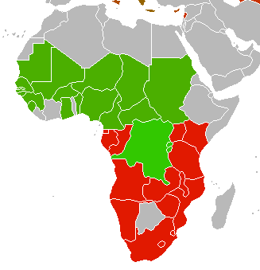

# Get Involved

The _afrimapr_ project is as much about growing a community as it is about developing code. We would love to hear from you!

### What are we looking for?

The project is brand new (it only kicked off in January 2020). We are working on a number of issues for which we received funding from the Wellcome Open Research fund. We believe you, as the community, may have many more ideas and needs than what is currently being addressed in the project and encourage you to let us know.

Ideally, we are looking for feedback on, and help with, the packages that are [under development](code) as our development team and volunteer community is currently very small. However, we’d love to hear your ideas for additional functionality that may be useful in your work. We are constantly looking for ways to make the project more sustainable by bringing more funders and collaborators on board and may be able to start work on novel features as well.

Below we describe a few ways in which you can get involved…

       
|-----------------------------|-----------------------|----------------|-------------------|
|<a href="https://twitter.com/afrimapr" target="_blank"> |   Talk to us on Twitter |  <a href="https://twitter.com/afrimapr" target="_blank">@afrimapr</a> |   Currently live |
||  Email us on the Google Group |   <a href="https://groups.google.com/forum/#!forum/afrimapr" target="_blank">https://groups.google.com/forum/#!forum/afrimapr</a>|  Currently live |
| |   Email Andy South (project lead) |   <a href="mailto:Andy.South@lstmed.ac.uk">Andy's email</a> |  Currently live |
|<a href="https://github.com/afrimapr/suggestions_and_requests/" target="_blank"> |   Make suggestions or request features as issues in Github |  <a href="https://github.com/afrimapr/suggestions_and_requests/" target="_blank">https://github.com/afrimapr/suggestions_and_requests/</a>|   Currently live |
|<a href="https://afrimapr.github.io/afrimapr.website/code"> |   Contribute to the R code |   <a href="https://afrimapr.github.io/afrimapr.website/code" target="_blank"> Project code </a>|   Currently live |
|<a href="https://afrimapr.github.io/afrimapr.website/code" target="_blank"> | Use the R building blocks in your own packages and scripts |   <a href="https://afrimapr.github.io/afrimapr.website/code/" target="_blank">Packages under development</a>| Early access as packages are under development |
|<a href="https://afrimapr.github.io/afrimapr.website/training" target="_blank"> |  Help us to develop training materials or teach someone to use _afrimapr_ tools |   <a href="https://afrimapr.github.io/afrimapr.website/training" target="_blank"> Training materials </a>| Not active yet as packages are in early phase of development |
|<a href="https://afrimapr.github.io/afrimapr.website/blog" target="_blank">| Contribute a guest blog post relevant to the _afrimapr_ project |   <a href="https://github.com/afrimapr/afrimapr.website/blob/master/CONTRIBUTE.md" target="_blank">Contribution guidelines</a> |   Currently live |
